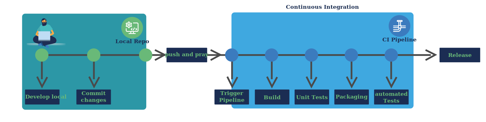
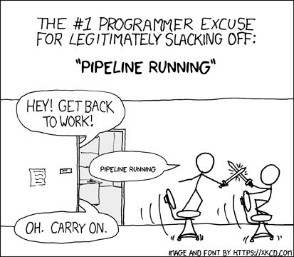

## Why another CI tool?

As a software developer you write your code in your local code base. To ensure your implementation works as intended, you build and test it locally. If you want to be extra sure, you can test it in a Docker container, mimicking the sandboxed conditions of the online environment.

Once your local tests succeed, you push your code into the remote code registry (for example GitLab), where it can be build and tested once again (by runing a pipeline).

Often the pipeline takes longer to run online, and you have to hope all the tests pass and wait ...

To see if and why the pipeline run succeeded, one has to check on the remote repository on GitLab.

If a pipeline fails, one can consult the logs but the information you find there often is vague. The solution often is to extend the pipeline with bash-scripts and tools to better understand what happened. This is a far cry from efficient debugging.
All the while you keep asking yourself these main questions:

* why did it work in the local context, but not on GitLab?
* which logs do I have to consult to find out why the pipeline failed?
* which information is missing? how can I better identify the problem?

The scenario of pushing code changes and not knowing if a pipeline succeeded is so common, that it coined the term "push-and-pray".

* Unpredictable: Unforseen error, which are difficult to locate.
* Slow Feedback: Error feedback comes with a delay.
* Time-consuming: Long error hunting and analysis.
* Error-prone: Missing opportunities to directly debug in the pipeline.
* Delayed Results: Long downtimes when waiting for pipeline results.
* Inconsistent: Differences between local and remote environments.
* Inefficient: Repeated workflows that waste resources.

We can conclude: the current situation has its problems, that need to be addressed to make working more efficient and on a personal level, less frustrating.

## How does Dagger help?

Dagger is set to give back the workflow control to the developers by allowing them to run a representative pipeline locally, improving flexibility and efficience.

Dagger can be shortly described as docker for your CI pipeline.
It allows developers to run the same pipeline locally as it runs remotely, by sandboxing it.

Additionally, dagger allows developers to work in the same programming language as their code is written in. This also enables developers to directly debug the processes.
