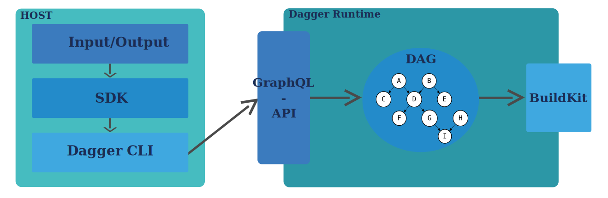

## How does dagger work under the hood?

*"Dagger is Docker for your CI Pipeline" - Jeremy Adams (probably)*

Let's start at the beginning. Containers have been around since the early 2000s, but only experienced a true upswing once Docker was introduced in 2013, as it mad working with containers easier and more intuitive.
Dagger works with similar principles as Docker, this is not surprising as the founder of Docker is also the founder of Dagger.

Dagger is based on an engine, at its heart the workflow is depicted as a Directed Acyclic Graph (DAG). The dagger engine receives outside communication via an GraphQL-API, which allows for a declarative definition of the separate pipeline steps. The output of the DAG is passed on to BuildKit. The whole process is executed in a container, this ensures consistency and portability.

### Host components

* **Input/Output** The inputs and outputs of the pipeline are defined here, such as files, environment variables or network resources. They form the foundation for the communication between different pipeline steps.
* **SDK** Enables the use of various programming languages such as Go, TypeScript, Java and Python to define pipelines flexibly and programmatically. Developers can use their preferred tools and frameworks.
* **Dagger CLI** A powerful command line tool that allows developers to start, test and debug pipelines. It also offers functions for visualizing and optimizing the workflow.

### GraphQL API

Mediates between the host and the Dagger Engine and serves as a central communication protocol. Developers can use this API to make queries to monitor the status of the pipeline or execute specific steps.
Enables declarative and flexible pipeline definitions, where each step is described as a clearly defined instruction in a graph-based structure. This makes complex workflows easier to maintain and understand.

### Dagger Engine

Here, the workflow is processed as a Directed Acyclic Graph (DAG), which ensures that each step is executed logically and without cyclic dependencies.
Each node in the graph represents a specific step in the pipeline, such as compiling code, executing tests or deploying artifacts. The engine ensures efficient execution and reusability of intermediate steps.

### BuildKit

The underlying technology of Docker that is responsible for the actual build and execution process. BuildKit ensures optimized builds, caching and parallelization of tasks.
It also enables better handling of dependencies and resources, significantly increasing the efficiency and speed of the pipeline.

With this architecture, Dagger bridges the gap between local workflows and CI/CD pipelines by enabling developers to build, test and debug complex pipelines locally. At the same time, integration into existing CI/CD systems remains seamless.

